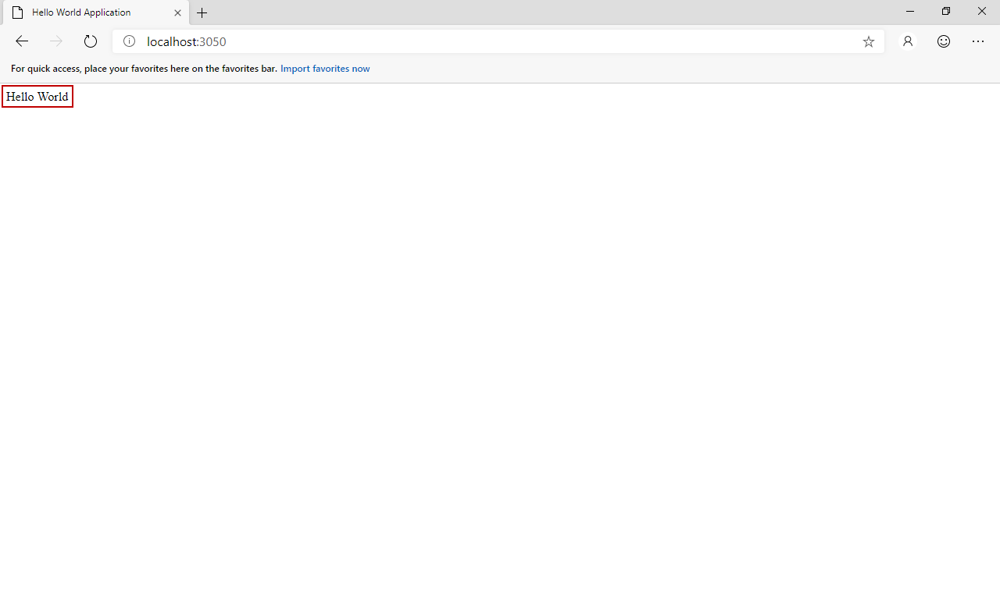

# Hello World Aquarium Tutorial

Prerequisites:

* Windows 7/8/10.
* .NET Framework 4.6.1 or higher.
* Visual Studio 2017 or higher.

In this tutorial, we show you how to create a Hello World application based upon Saposs concepts and Saposs Aquarium. When user requests the home page, it will display "Hello World" text.

At first, please download Saposs Aquarium and try to get it running on your local computer.

## Step 1: Create a simple view to display Hello World

* Create a new project named HelloWorldWFApp.Views.HelloWorldView using Visual Studio.
* Add these two references: Saposs.Framework and System.ComponentModel.Composition. You can find them in either project templates or Saposs Aquarium source.
* Add a new View.cshtml file and set it as embedded file.

``` cshtml
<html>
    <head>
        <title>Hello World Application</title>
    </head>
    <body>
        @Model.Text
    </body>
</html>
```

* Create a new View class as follows:

``` csharp
using Saposs.Framework;
using Saposs.Framework.Enums;
using System;
using System.Collections.Generic;
using System.ComponentModel.Composition;
using System.IO;
using System.Linq;
using System.Reflection;
using System.Text;
using System.Threading.Tasks;
using System.Web;

namespace HelloWorldAquariumApp.Services.HelloWorldView
{
    [Export(typeof(IView))]
    public class View : IWebMvcView
    {
        public List<object> Deps => new List<object>();

        public bool IsDefault => true;

        public bool IsAdmin => false;

        public ViewTypes Type => ViewTypes.WebPage;

        public string Name => Assembly.GetExecutingAssembly().GetName().Name;

        public string Title => "Hello World View";

        public List<string> Dependencies => new List<string>();

        public string Description => "Represents as the Hello World view.";

        public string Version => "Version 1.0.0";

        public DateTime CreatedDate => new DateTime(2019, 5, 12);

        public DateTime? UpdatedDate => null;

        public bool IsEnabled => true;

        public int Order => 1;

        // set end-user to test in both dev and release mode.
        public string Route { get; set; } = "end-user";

        public string TemplateName { get; set; }

        public object Get()
        {
            return Utils.ReadAssemblyResourceFile<View>();
        }
    }
}
```

* Build this project.

## Step 2: Create a simple handler to change model

* Create a new project named HelloWorldAquariumApp.Handlers.HelloWorldHandler using Visual Studio.
* Create a new Handler class as follows:

``` csharp
using Saposs.Framework;
using System;
using System.Collections.Generic;
using System.ComponentModel.Composition;
using System.Linq;
using System.Reflection;
using System.Text;
using System.Threading.Tasks;

namespace HelloWorldAquariumApp.Handlers.HelloWorldHandler
{
    [Export(typeof(IHandler))]
    public class Handler : IWebMvcHandler
    {
        public string Name => Assembly.GetExecutingAssembly().GetName().Name;

        public string Title => "Hello World Handler";

        public string Description => "...";

        public string Version => "Version 1.0.0";

        public DateTime CreatedDate => new DateTime(2019, 5, 11);

        public DateTime? UpdatedDate => null;

        public bool IsEnabled => true;

        public int Order => 2;

        public List<string> Dependencies => new List<string>();

        public string Route { get; set; } = "/";

        public void Execute()
        {
            var model = Utils.ExecuteMvcService<dynamic>("/");
            model.Text = "Hello World";
        }
    }
}
```

* Build this project.

## Step 3: Create a simple service to return text

* Create a new project named "HelloWorldAquariumApp.Services.HelloWorldService".
* Create a new Service class as follows:

``` csharp
using Saposs.Framework;
using System;
using System.Collections.Generic;
using System.ComponentModel.Composition;
using System.Linq;
using System.Reflection;
using System.Text;
using System.Threading.Tasks;

namespace HelloWorldAquariumApp.Services.HelloWorldService
{
    [Export(typeof(IService))]
    public class Service : IWebMvcService
    {
        public string Name => Assembly.GetExecutingAssembly().GetName().Name;

        public string Title => "Hello World Service";

        public List<string> Dependencies => new List<string>();

        public string Description => "Represents as the Hello World service.";

        public string Version => "Version 1.0.0";

        public DateTime CreatedDate => new DateTime(2019, 5, 12);

        public DateTime? UpdatedDate => null;

        public bool IsEnabled => true;

        public int Order => 1;

        public string Route { get; set; } = "/";

        public dynamic Model = new System.Dynamic.ExpandoObject();

        public object Execute(params object[] objs)
        {
            return Model;
        }
    }
}
```

* Build this project.

## Step 4: Deploy components to Saposs Aquarium

* Open Saposs Aquarium.
* Go to admin page.
* Choose the "Upload Component" tab.
* Upload the .dll view file from bin\Debug or bin\Release of HelloWorldAquariumApp.Views.HelloWorldView project.
* Upload the .dll handler file from bin\Debug or bin\Release of HelloWorldAquariumApp.Handlers.HelloWorldHandler project.
* Upload the .dll service file from bin\Debug or bin\Release of HelloWorldAquariumApp.Services.HelloWorldService project.


* Delete the default end-user view "Saposs.Views.EndUserView".

## Step 5: Test application

* Go to user page.
* The Hello World text will be shown.



## Step 6: Release application

* Go to "Settings" tab to press the "Hide Admin" page.
* Compress your portable source and then copy it to anywhere to execute.

You can download the entire source code [here](http://www.saposs.com/downloads/HelloWorldAquariumTutorial.zip).

Additionally, we still would continue to upgrade Saposs Aquarium to make it better. If any problem, please create a new issue [here](https://github.com/saposs-org/saposs-tracker). We always are looking forwarding to hear from you.

Again, also thanks a lot for reading!