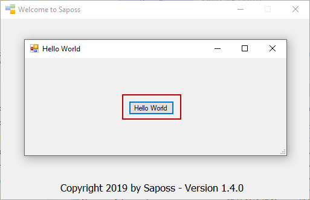

# Hello World WF Tutorial

Prerequisites:

* Windows 7/8/10.
* .NET Framework 4.6.1 or higher.
* Visual Studio 2017 or higher.

In this tutorial, we show you how to create a Hello World application based upon Saposs concepts and Saposs WF. When user clicks on Greet button, this button content will be changed to "Hello World".

At first, please download Saposs WF and try to get it running on your local computer.

## Step 1: Create a simple view containing the Greet button

* Create a new project named HelloWorldWFApp.Views.HelloWorldView using Visual Studio.
* Add these three references: Saposs.Framework, System.ComponentModel.Composition and System.Windows.Forms. You can find them in either project templates or Saposs WF.
* Add a new Form named ViewForm.
* Add a new Greet Button as follows:

``` csharp
namespace HelloWorldWFApp.Views.HelloWorldView
{
    partial class ViewForm
    {
        /// <summary>
        /// Required designer variable.
        /// </summary>
        private System.ComponentModel.IContainer components = null;

        /// <summary>
        /// Clean up any resources being used.
        /// </summary>
        /// <param name="disposing">true if managed resources should be disposed; otherwise, false.</param>
        protected override void Dispose(bool disposing)
        {
            if (disposing && (components != null))
            {
                components.Dispose();
            }
            base.Dispose(disposing);
        }

        #region Windows Form Designer generated code

        /// <summary>
        /// Required method for Designer support - do not modify
        /// the contents of this method with the code editor.
        /// </summary>
        private void InitializeComponent()
        {
            this.btnGreet = new System.Windows.Forms.Button();
            this.SuspendLayout();
            // 
            // btnGreet
            // 
            this.btnGreet.Location = new System.Drawing.Point(172, 71);
            this.btnGreet.Name = "btnGreet";
            this.btnGreet.Size = new System.Drawing.Size(75, 23);
            this.btnGreet.TabIndex = 0;
            this.btnGreet.Text = "Greet";
            this.btnGreet.UseVisualStyleBackColor = true;
            // 
            // ViewForm
            // 
            this.AutoScaleDimensions = new System.Drawing.SizeF(6F, 13F);
            this.AutoScaleMode = System.Windows.Forms.AutoScaleMode.Font;
            this.ClientSize = new System.Drawing.Size(433, 161);
            this.Controls.Add(this.btnGreet);
            this.Name = "ViewForm";
            this.Text = "Hello World";
            this.ResumeLayout(false);

        }

        #endregion

        private System.Windows.Forms.Button btnGreet;
    }
}
```

* Open ViewForm.cs to add dependencies as follows:

``` csharp

using System;
using System.Collections.Generic;
using System.ComponentModel;
using System.Data;
using System.Drawing;
using System.Linq;
using System.Text;
using System.Threading.Tasks;
using System.Windows.Forms;

namespace HelloWorldWFApp.Views.HelloWorldView
{
    public partial class ViewForm : Form
    {
        public ViewForm()
        {
            InitializeComponent();
            DepControls.Add(btnGreet);
        }

        internal List<object> DepControls = new List<object>();
    }
}
```

* Create a new View class as follows:

``` csharp
using Saposs.Framework;
using Saposs.Framework.Enums;
using System;
using System.Collections.Generic;
using System.ComponentModel.Composition;
using System.Linq;
using System.Reflection;
using System.Text;
using System.Threading.Tasks;
using System.Windows.Forms;

namespace HelloWorldWFApp.Views.HelloWorldView
{
    [Export(typeof(IView))]
    public class View : IView
    {
        private ViewForm form = new ViewForm();

        public bool IsDefault => true;

        public bool IsAdmin => false;

        public ViewTypes Type => ViewTypes.WForm;

        public string Title => "Hello World View";

        public string Description => "This is a hello world view.";

        public string Version => "Version 1.0.0";

        public DateTime CreatedDate => new DateTime(2019, 5, 12);

        public DateTime? UpdatedDate => null;

        public bool IsEnabled => true;

        public int Order => 2;

        public List<object> Deps => form.DepControls;

        public string Name => Assembly.GetExecutingAssembly().GetName().Name;

        public List<string> Dependencies => form.DepControls != null ? form.DepControls.Select(s => (s as Control)?.Name ?? s.GetType().Name).ToList() : new List<string>();

        public object Get()
        {
            Utils.ExecuteHandler("HelloWorldWFApp.Handlers.HelloWorldHandler");
            return form;
        }
    }
}
```

* Build this project.
* Create a new folder "View".
* Create a new folder "Deps" in this folder.
* Copy the DLL component and paste it to View folder.
* Choose the DLL component and Deps folder and then compress them.

## Step 2: Create a simple handler to raise the Greet button's event

* Create a new project named HelloWorldWFApp.Handlers.HelloWorldHandler using Visual Studio.
* Create a new Handler class as follows:

``` csharp
using Saposs.Framework;
using System;
using System.Collections.Generic;
using System.ComponentModel.Composition;
using System.Linq;
using System.Reflection;
using System.Text;
using System.Threading.Tasks;
using System.Windows.Forms;

namespace HelloWorldWFApp.Handlers.HelloWorldHandler
{
    [Export(typeof(IHandler))]
    public class Handler : IHandler
    {
        public string Name => Assembly.GetExecutingAssembly().GetName().Name;

        public string Title => "Hello World Handler";

        public string Description => "...";

        public string Version => "Version 1.0.0";

        public DateTime CreatedDate => new DateTime(2019, 5, 12);

        public DateTime? UpdatedDate => null;

        public bool IsEnabled => true;

        public int Order => 2;

        public List<string> Dependencies => new List<string>();

        public void Execute()
        {
            var view = Utils.GetView("HelloWorldWFApp.Views.HelloWorldView");
            if (view?.Deps.Count > 0)
            {
                var btn = (view.Deps[0] as Button);
                if (btn != null)
                {
                    btn.Click += (sender, args) => {
                        btn.Text = Utils.ExecuteService<string>
                        ("HelloWorldApp.Services.HelloWorldService");
                    };
                }
            }
        }
    }
}
```

* Build this project.
* Create a new folder "Handler".
* Create a new folder "Deps" in this folder.
* Copy the DLL component and paste it to Handler folder.
* Choose the DLL component and Deps folder and then compress them.

## Step 3: Create a simple service to return text

* Create a new project named "HelloWorldApp.Services.HelloWorldService".
* Create a new Service class as follows:

``` csharp
using Saposs.Framework;
using System;
using System.Collections.Generic;
using System.Linq;
using System.Reflection;
using System.Text;
using System.Threading.Tasks;

namespace HelloWorldWFApp.Services.HelloWorldService
{
    [Export(typeof(IService))]
    public class Service : IService
    {
        public string Name => Assembly.GetExecutingAssembly().GetName().Name;

        public string Title => "Hello World Service.";

        public List<string> Dependencies => new List<string>();

        public string Description => "Represents as the service for returning the Hello World text.";

        public string Version => "Version 1.0.0";

        public DateTime CreatedDate => new DateTime(2019, 5, 12);

        public DateTime? UpdatedDate => null;

        public bool IsEnabled => true;

        public int Order => 1;

        public object Execute(params object[] objs)
        {
            return "Hello World";
        }
    }
}
```

* Build this project.
* Create a new folder "Service".
* Create a new folder "Deps" in this folder.
* Copy the DLL component and paste it to Service folder.
* Choose the DLL component and Deps folder and then compress them.

## Step 4: Deploy components to Saposs WF

* Open Saposs WF.
* Go to admin page.
* Choose the "Upload Component" tab.
* Upload the zipped view file.
* Upload the zipped handler file.
* Upload the zipped service file.

## Step 5: Test application

* Go to user page.
* Press the "Greet" button.


* The button's text will be changed to "Hello World".



## Step 6: Release application

* Go to "Settings" tab to press the "Hide Admin" page.
* Compress your portable source and then copy it to anywhere to execute.

You can download the entire source code [here](http://www.saposs.com/downloads/HelloWorldWFTutorial.zip).

Additionally, we still would continue to upgrade Saposs WF to make it better. If any problem, please create a new issue [here](https://github.com/saposs-org/saposs-tracker). We always are looking forwarding to hear from you.

Again, also thanks a lot for reading!