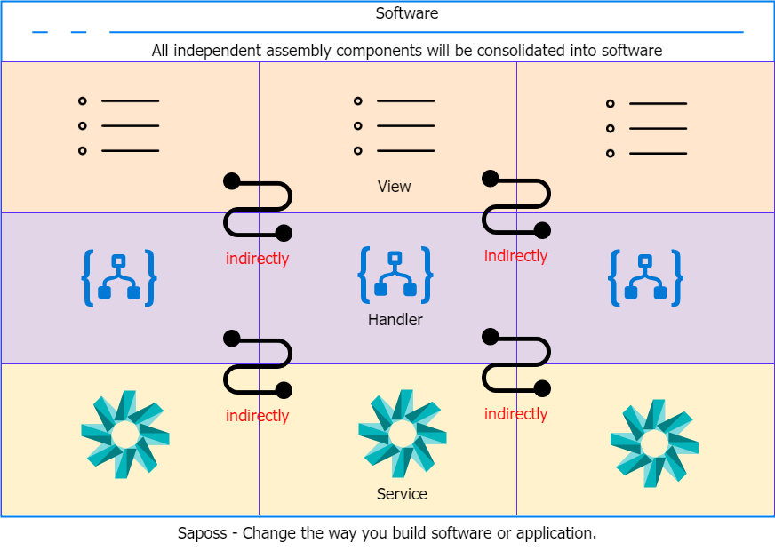

# Welcome to Saposs

Saposs(abbr. `Simple As POSSible`) was given birth to make the software development better and easier. Saposs changes the way to build either software or application
which all independent assembly components will be consolidated into.

## Saposs Products

* Saposs WF(for Windows Forms).
* Saposs Aquarium(for ASP.NET MVC).

## How does Saposs work?

Basically, the software or application is made from a set of various modules. That's why Saposs addressed into each software module. Saposs relied on a very simple concept which separates each software module into 3 parts: view, handler and service. View can be Forms, User Controls, etc... In the meantime, Handler is responsible for handling the business logics. And finally, Service represents as a set of utilities, helpers as well as function APIs. At the behind of the stage, Saposs will help you to connect
between them indirectly.

## Why using Saposs?

Without Saposs, you have to create all software components that will depend on much more together. From day to day, its size will get bigger and difficult to maintain. Also, it
costs much money for doing that.

That's why Saposs was given birth to solve this problem. Our idea is to support for plugging in and -out all software components easily without affecting any others.

## Bugs or Issues

If any problem is found, please report any bug or issue to [Saposs Issues](https://github.com/saposs-org/saposs-tracker/issues). We always appreciate your contributions. Thanks a lot :)

## Copyright and License

&copy; Copyright 2019 by [Saposs](http://www.saposs.com). All rights reserved.
