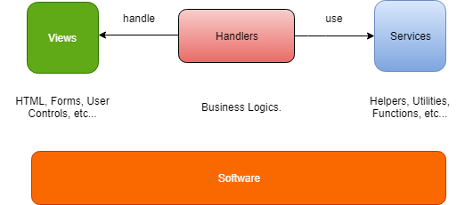

# Welcome to Saposs

Saposs(abbr. `Simple As POSSible`) was given birth to make the software development better and easier than before.

## Saposs Products

* Saposs WF(for Windows Forms).

## How does Saposs work?

Basically, the software or application is made from a set of various modules. That's why Saposs addressed into each software module. Saposs relied on a very simple concept which separates each software module into 3 parts: view, handler and service. View can be Forms, User Controls, etc... In the meantime, Handler is responsible for handling the business logics. And finally, Service represents as a set of utilities, helpers as well as function APIs.

## Why using Saposs?

Without Saposs, you have to create all software components that will depend on much more together. That's why Saposs WF was given birth to solve this problem. This idea is to support for plugging in and -out all software components easily without affecting any others. It will be getting easier to maintain and also save much money for you.

## Bugs or Issues

If any problem is found, please report any bug or issue to [Saposs Issues](https://saposs-org.github.io/saposs-tracker/issues). We always appreciate your contributions. Thanks a lot :)

## Copyright and License

&copy; Copyright 2019 by Saposs. All rights reserved.
