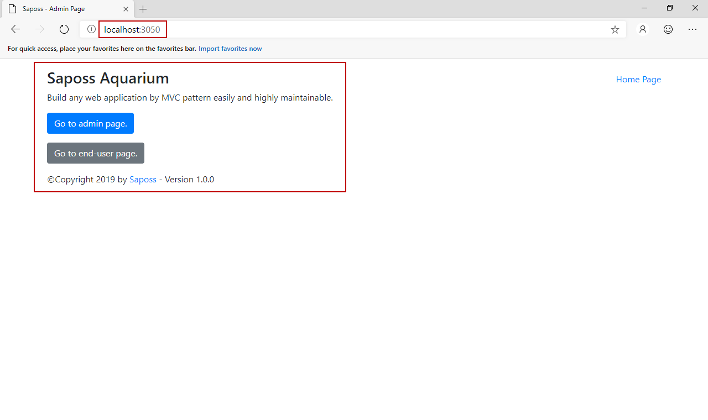

# Introduce Saposs Aquarium

Saposs Aquarium is a web application which built on Saposs Framework and ASP.NET MVC. It assists you to build any web application which will get easier to maintain.

## Why using Saposs Aquarium?

Saposs Aquarium offers you a simple UI to manage all components. Additionally, you're able to configure the settings.

## How does Saposs Aquarium work?

Its concept is similar as Saposs WF.

## Install Saposs Aquarium

In order to install Saposs Aquarium, please follow the following requirements:

- Make sure that your computer has installed .NET Framework 4.0 or higher.
- Download Saposs Aquarium from [here](http://www.saposs.com/developers/download).
- Unzip/unrar the downloaded source.
- Install IIS(via [Programs and Features in Windows](https://bit.ly/2nvVviX)) or [IIS Express](https://bit.ly/2VYkJJy).
- Open IIS Manager.
- Create a new website by right-clicking on the Sites and then choose "Add Website".
- Point to the unzipped source.
- At the "Host Name" section, choose localhost by default.
- At the "Port" section, enter any port which you want.
- Ensure that that folder has IIS/ASP.NET Permission or you can set Application Pool Identity to LocalSystem or LocalService without requiring any permission.
- Completed.

The result as screenshot:

Congratulations, from now, you can get started to use Saposs Aquarium :)