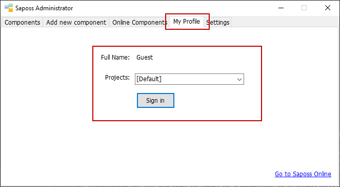
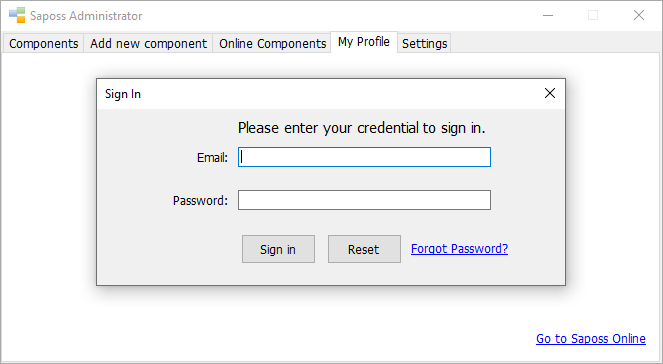
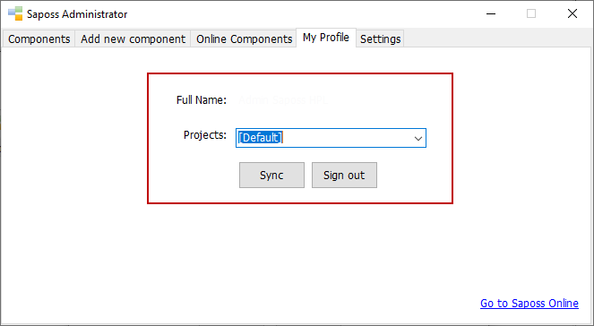

# Manage Live Projects

Starting from the new version 1.4.0 of Saposs WF, you're able to manage your live projects by signing in and then synchronizing your projects anywhere as long as your internet connection is available. Here's a new feature which helps any developer to be able to release any project anywhere easily. Currently, Saposs Aquarium isn't supported yet.

In order to do that, please follow some following steps:

* Download and open Saposs WF v1.4.0.
* Press the button "Go to admin page."
* Select the tab "My Profile".

* Press the button "Sign In".

* Enter your credential to sign in.
* The result is as follows:

* To synchronize your project into current Saposs WF instance, please choose a project in combobox at the previous screenshot. Then, continue to press "Yes".
* Completed.
