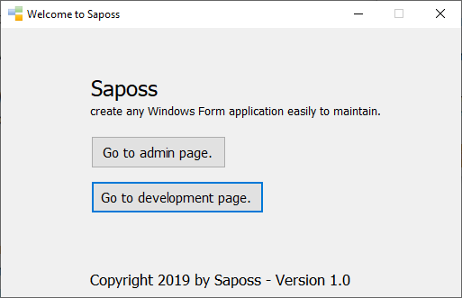
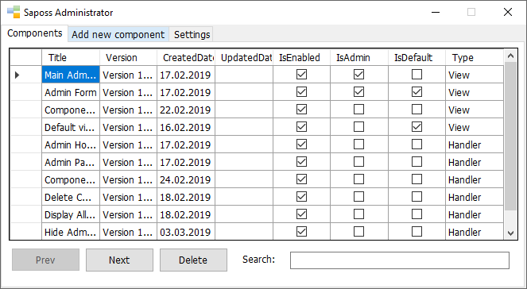
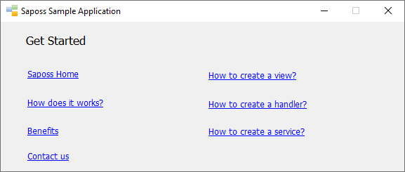

# Quick Tour

Saposs WF offers you three simple pages/forms to use:

- Start Page.
- Administrator Page.
- Default Page.

## Start Page

Here you can navigate to the administrator page or default page as screenshot.

## Administrator Page

Here you're able to manage all software components and configure settings as screenshot.

## Default Page

Here is a default page which will be shown to end-users. You can update this page later.

