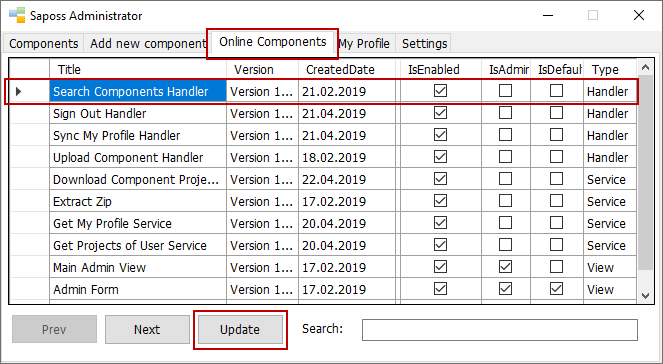

# Syncronize Online Components

Starting from the new version 1.4.0 of Saposs WF, you're able to synchronize publicly online components back to your local computer. Its main advantage is to reuse any public online component for your application. After that, anywhen you also can update it into Saposs WF as long as your internet connection is available. Currently, Saposs Aquarium isn't supported yet.

In order to update it, please follow some following steps:

* Download and open Saposs WF v1.4.0.
* Press the button "Go to admin page."
* Select the tab "Online Components".
* Choose any component in grid.
* Press the button "Update".
* Completed.

For instance as screenshot:

