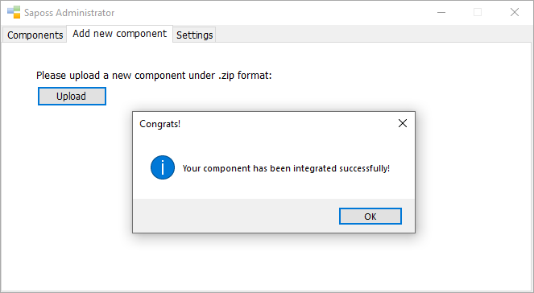
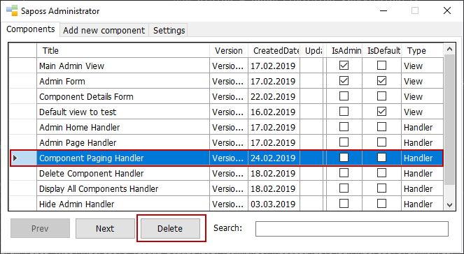

# Upload Component

In case a component is unknown in the administrator page, you're able to upload your completed components steps by steps as follows:

- Make sure that your component is finished.
- Please zip your component.
- Open Saposs WF.
- Click the button "Go to admin page".
- Choose the tab "Add new component".
- Click the button "Upload".
- Choose the compressed component file.
- If everything is good, you will receive a message as screenshot. Otherwise, please try again.

Additionally, by default, Saposs WF doesn't support for updating an existing component directly due to a couple of internal factors. Maybe it would be supported in the near future. In order to do that, at first, please delete an existing component which you would like to update. After that, Saposs WF will be restarted to reflect any changes. Finally, you follow steps by steps as above to upload the new version of your component again.

In order to delete an existing component, please follow the following requirements:

- Make sure that your Saposs WF is running.
- Go to the tab "Components".
- Choose an existing component.
- Click the button "Delete" as screenshot. ``

- A dialog will be shown to warn you about deleting an existing component.
- Click the button "yes" to continue.
- Your Saposs WF will be restarted to proceed to delete it.
- Completed.